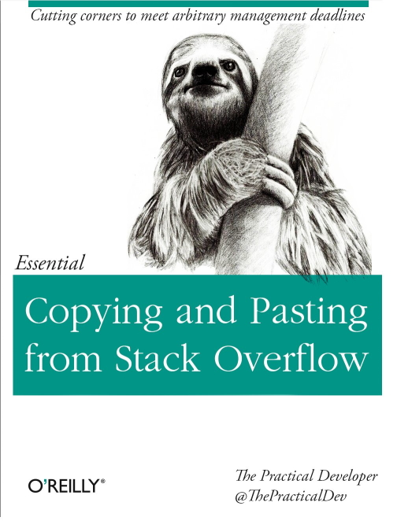

# Essential Copying and Pasting From Stack Overflow

Author: [Tariq Ali](https://tra38.github.io/)

The book was originally published on [GitBook](https://tra38.gitbooks.io/essential-copying-and-pasting-from-stack-overflow/).

This work is licensed under a [Creative Commons Attribution 4.0 International License](https://creativecommons.org/licenses/by/4.0/).

## Introduction

Inspired by this cover. The book is written in a deadpan manner.

Source: [ThePracticalDev @ Twitter](https://twitter.com/ThePracticalDev/status/705825638851149824).

## Code Licensing Issues

Before you can copy and paste code, you have to make sure you have the *legal right* to copy and paste that code. Without that legal right, you would just be stealing other people's intellectual property. That would just be *lazy*.

Most code on Stack Overflow are 'snippets'. They do not meet standards of originality and as a result have no copyright protection. You are free to copy and paste them without any worry about losing a lawsuit.

Some code on Stack Overflow are much longer than 'snippets'. They therefore qualify for copyright protection. By default, all content on Stack Overflow (including code) is licensed under the CC-BY-SA 3.0 license.

This license is not recommended for use in software at all, and SO is currently looking to replace this license for future code posted on its website. For now, though, the CC-BY-SA 3.0 is law. Even if SO does change its future licensing policies, all previous code will still remain under CC-BY-SA 3.0.

CC-BY-SA 3.0 is a copyleft license just like GPL 3.0. Essentially, you can use all code licensed under CC-BY-SA 3.0 so long as:

* You give attribution to the website where you got the code.
* You license your codebase under the same terms as the CC-BY-SA 3.0. Again, the CC-BY-SA 3.0 is not recommended for use in software, so licensing your software under CC-BY-SA 3.0 is pretty much a non-starter.

However, there is some legal wizardy you can do to relicense your Stack Overflow code from ugly CC-BY-SA 3.0 to a proper Open Source license that is suitable for software. Here how it works.

1. Any creative work licensed under CC-BY-SA 3.0 can be upgraded to CC-BY-SA 4.0, automatically.
2. According to [the Creative Commons website](https://creativecommons.org/compatiblelicenses/), CC-BY-SA 4.0 is compatible with both [GPL 3.0](https://www.gnu.org/copyleft/gpl.html) and the [Free Art License](http://artlibre.org/licence/lal/en/). Both the GPL 3.0 and the Free Art License are copy-left licenses.

There is no real way to distinguish between a 'code snippet' with no copyright protection and a much larger block of code that *does* contain copyright protection (and thus is licensed under CC-BY-SA 3.0). You could use common sense to decide whether some code qualifies as a "snippet" or not, but if the courts share a different definition of a "snippet" than you, you are out of luck.

If you are working on a permissive or proprietary codebase, you have four options.

* Change the codebase to GPL 3.0 or the Free Art License and start copying and pasting code with ease.
* Hire an expensive lawyer to defend your right to use code snippets from Stack Overflow...
* Hope that the person you're copying and pasting from doesn't care enough about your violation of the CC-BY-SA 3.0 license to sue you.
  * I recommend this approach because the odds of the other user stumbling upon your codebase and complaining about you not adhering to the terms of the CC-BY-SA 3.0 is lower than the odds of this book actually being published by O'Reilly. If you are very unlucky (and that can happen), then you can simply apologize and then rewrite the offending code.
* ...or write your own pseudo-[Clean Room](https://en.wikipedia.org/wiki/Clean_room_design) implementation of the Stack Overflow code.

Here is a step-by-step guide:

1. Write down some notes about the code from Stack Overflow, specifically how it works, how you should implement it, etc.
2. Close the web browser.
3. Wait a few minutes so that you forget the code.
4. Use the information in your notes to re-implement the Stack Overflow code in question.
5. You now own the copyright to your code in question...even if the final code is *exactly the same* as the original Stack Overflow answer. Since you now own the copyright to this code, you may integrate it into your permissive or proprietary codebase.

This approach is slower than the traditional "CTRL-C, CTRL-V" approach to copying and pasting. However, it does have the benefit of giving you a deeper understanding of the Stack Overflow code. This could be helpful as you will likely need to maintain this code in the future.

There is one last point to conclude in this chapter. Some users may add a permissive license to their code submissions to Stack Overflow. In that case, you can elect to adhere to the terms of this permissive license instead of worrying about the copyleft CC-BY-SA 3.0. Check the profile of the user who posted the "code" to see whether the code is available under a different license.

## Code Attribution

When you copy and paste code from Stack Overflow, it is *best practice* to provide a link to the place where you got that code. This is for two reasons:

1. The person has helped you greatly by giving you some valuable code. You should reward them by giving the programmer a comment in a codebase that they are never ever going to see.
2. It's useful to look back at the answer in case you need to debug the code later. This is very useful if the author of the code in question also wrote a detailed explanation of his code.

Sometimes, during the course of a project, the original SO code will be heavily modified by you. In that case, it makes no sense to keep the attribution, since you have thoroughly mutilated the work of the original author. There is no reason to praise the author anymore, and the author's detailed explanations may prove useless thanks to your own modifications. Remove the comment from your code ASAP.

Use your professional judgment when deciding when to give attribution and when you should remove it.

Note while that attribution is generally not required for 'code snippets', they are usually required if you are complying with the terms of a license (either the default CC-BY-SA 3.0 or a permissive license).

## What Code To Copy?

Generally, when you search for a question on Stack Overflow, you can usually find a answer to your problem. This is not always a good thing.

* Some of the answers on Stack Overflow may be plain wrong. *Anyone* can answer a question on Stack Overflow, so just because it is online does not mean it is true. While obviously wrong answers can be downvoted, not so obvious answers may be highly voted. In addition, you usually cannot be certain at all that the code in question actually compiles or work until you try it out yourself.
* Some of the answers may devoid of explanation and be composed of nothing more than code. While this may seem like a good idea for the eager copy-and-paster, it really isn't. You need to know *what* the code is actually doing. After all, you will have to maintain that code in the future.
* Some of the answers are legacy answers. They worked in the past, but are now no longer best practice. Stack Overflow suffers from the "fastest gun in the west" syndrome where whoever answers the question first usually gets the most votes, and thus is seen first. The more "modern" answers usually don't get as many votes and tend to languish on the bottom of the page.

This is why it is an absolutely horrible idea to blindly copy and paste the first answer to a Stack Overflow question. I've done it. It never works.

Instead, scroll down to read all answers to a question, as well as all the comments to the answers as well. They will provide you some more information and clarification so you can make a more informed choice on what code to copy and paste. Also, consider looking at the sidebar of Stack Overflow and explore the linked questions and related questions as well.

Viewing the date of a question and its answers is also helpful as well. Stack Overflow is a website with a long history, and knowing the publication date of content is really helpful in knowing whether the content is current or if it may be rendered obsolete by more updated content. This does not mean that you should reject an answer just because it is a year or two old. But it does give you an additional data point to help you make a professional judgment call.

If you are unhappy with a question and its answers, don't worry. Search further. Stack Overflow tends to frown on people asking the same question over and over again. Yet it still happens regularly. Usually those questions can end up being closed as being a 'duplicate', but they are not deleted and can still be accessed normally. Search for these "duplicated" questions, and you may find answers that are much better than the so-called "canonical" version.

Finally, keep in mind that you *don't* have to copy and paste only one code snippet. You can certainly mix-and-match different approaches. This can be slightly problematic if you wish to provide attribution for all the different code snippets you copied and pasted from, but you can usually handle this issue if it comes up.

## Appendix: Ready-Made Code

Stack Overflow is structured as a Q&A website. Users ask questions, and people respond with answers. The website officially discourage 'discussions', where people talk about the proper way of solving a problem endlessly. Instead, you should get your answer quickly to a real problem.

Therefore, on Stack Overflow, it is hard to stumble upon ready-made programs ready for you to copy and paste blindly. On Stack Overflow, code is designed to solve unique and specialized problems, not just vomit out a complete, working program.

This is *not* the case if you go to other Q&A websites located on the broader Stack Exchange platform (which is where 'Stack Overflow' is hosted at). Q&A sites such as "Code Review" or "Code Golf" serve as repositories of "ready-made code".

* ["Code Review"](http://codereview.stackexchange.com/) is a website where coders review other people's working programs and make suggestions on how to improve them. (Example: [Working Tic-Tac-Toe Game using Python, JavaScript, PHP and HTML](http://codereview.stackexchange.com/questions/123337/python-javascript-php-html-unbeatable-tic-tac-toe))
* ["Code Golf"](http://codegolf.stackexchange.com/) is a website where users accept challenges to produce working programs that meets certain criteria (e.g., size). (Example: [Naïve Markov Chain Word Generation](http://codegolf.stackexchange.com/questions/75673/na%C3%AFve-markov-chain-word-generation))

All code located on "Code Review" or "Code Golf" is licensed under the CC-BY-SA 3.0 (just like the code on "Stack Overflow"). Most of them are *not* code snippets...after all, they are usually fully-fledged working programs, not one or two lines of code.

Translating the code in question into another language would also count as a derivative work (after all, you were inspired by somebody's code to write your own version of it), so you would still have to comply with the terms of the CC-BY-SA 3.0 license.

If you are running a copyleft codebase, there's no legal problem involved in using code on "Code Review" or "Code Golf". If you are working on a proprietary or permissive codebase though, then you may have consider performing the pseudo-"Clean Room" implementation that I discussed back in the Code Licensing chapter.

It is not a good idea to use Code Review and Code Golf to find "ready-made code". "Ready-made code" already exists on code hosting websites such as SourceForge, BitBucket and GitHub, in the form of open-source software with proper software licenses. It is easier to find "ready-made code" on those sites that matches your own unique needs.

Using code from Code Review and Code Golf may also be rather unethical, since you are just taking advantage of the fact that everything is automatically licensed on Stack Exchange under CC-BY-SA 3.0 with no exception. The people posting their FizzBuzz code on "Code Review" want to have their own code reviewed, not to have it be reused by you.

However, you *can* copy and paste code from Code Review and Code Golf legally. The answers and comments on the provided code in question can be incredibly helpful as well and could theoretically improve your own coding ability.
